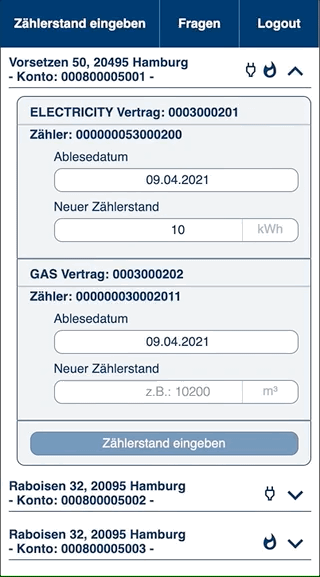
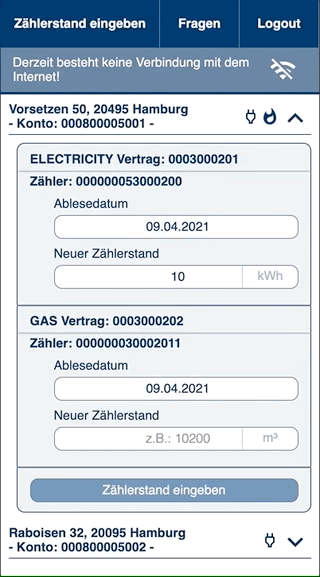
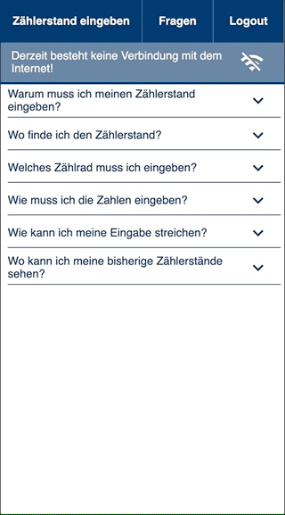

# meter-reading-pwa
This is a project created in cooperation with BPC AG and got created as our final project of the Digital Shaper Track from Techlabs.
We worked in a team of 4 (1 UX/UI-Designer, 2 Backend, 1 Frontend #me). Credits for the idea and scope of the created MVP belongs to BPC.

## Goal
- Create a PWA which lets the user enter meter data as a minimal viable product

## Challenges
- The PWA is supposed to work offline after an initial Login process and upload data to an API as soon as the user gets reconnected
- Fetch, alter and post data to an individual API provided by BPC
- Create an own backend to acces from the frontend to bypass CORS-Policies
- Use React

## Result
### User Workflow

### Connection loss

### Offline Entry

### FAQ section

## Tools & Libraries used
- React
- styled Components
- Axios
- Bootstrap
- date-fns
- express
- is-offline
- node-fetch
- nodemon
- react-datepicker
- React-Spring
- service worker

## Learnings
- coming soon
- Styled components aren't always the way to go

### New:
- Date-picker & Date handling
- Proper use of a new API

## Next Steps
